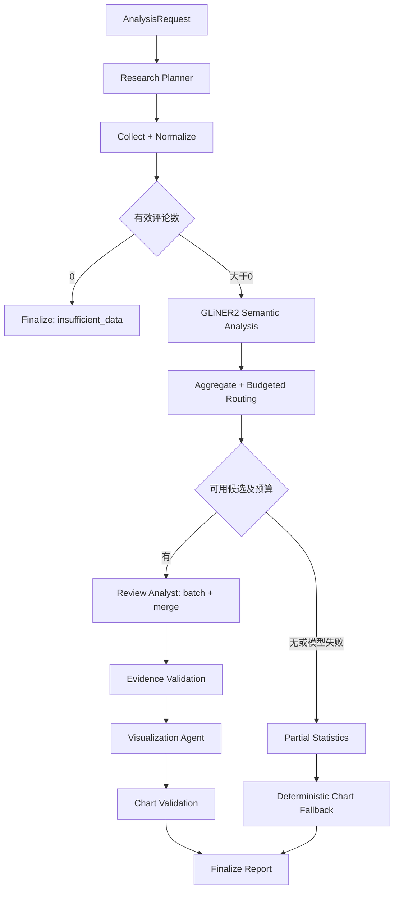

# MarketLens AI — Tech Design Spec

日期：2026-10-02。状态：F00开发环境、F01数据与Agent契约已实现，后续业务尚未实现。依据：`MarketLens_AI_PRD_v0.1.md` **正文 v0.2**；保留原文件，不以文件名判断版本。

## 1. 目标、边界与已确认默认值

完成产品名称/分析目标输入 → 本地或 淘宝 评论 → GLiNER2 结构化与路由 → 证据支撑的洞察 → Streamlit Dashboard。保留 Planner、Review Analyst、Visualization 三个 Agent，采集和统计为确定性节点。

用户已确认：中文评论优先、中文 UI/报告；可配置 OpenAI 兼容 LLM；进入 LLM 的独立评论数严格低于有效评论的 30%。推理设备默认本地 CPU。中文/中英混合产品术语进入首版评估，英文为次要兼容范围，不静默翻译原始评论。

MVP 不做 GitHub Issues 接入、自动商业决策、互联网通用爬虫、多用户服务、训练/微调、自动发布。PRD 中的 RAG 首先实现运行内证据检索；跨报告向量检索、embedding 和向量库延期，不作为首版必要依赖。

技术基线：Python 3.12、uv、Pydantic v2、LangGraph、langchain-core、LangChain 兼容接口适配器、GLiNER2、Streamlit、Altair、SQLite、Playwright（淘宝采集）、pytest、Ruff。安装阶段验证兼容性后提交 `uv.lock`；不能将官方 main 的接口直接等同于已发布版本。

## 2. 架构与节点流



正常节点返回 `Partial<State>`，不就地修改 State。LangGraph 使用 `TypedDict` State；节点边界以 Pydantic 校验业务对象。MVP 图顺序执行，批次在节点内部处理，避免多节点同时覆盖共享列表。三个 Agent 是具有独立契约/提示词的节点，不使用无限循环 ReAct。参考 [StateGraph 官方接口](https://reference.langchain.com/python/langgraph/graph/state/StateGraph)。

## 3. LangGraph State Schema

以下是设计级类型声明，不是本轮实现代码。所有业务对象以可 JSON 序列化的 dict 存储；model/client/tokenizer、密钥、文件句柄通过 `context_schema` 注入，不进入持久化 State。

F01已在 `src/marketlens/contracts/state.py` 落地同名TypedDict；此轮仅声明状态类型，F03才安装LangGraph并实现节点更新与运行时Context。

```python
class AnalysisState(TypedDict):
    schema_version: str                 # "1.0"
    run_id: str                         # UUID; checkpoint thread_id
    status: Literal["running", "complete", "partial", "insufficient_data", "failed"]
    stage: str                          # 最近完成的阶段
    request: dict                       # AnalysisRequest
    plan: dict | None                   # PlannerOutput
    reviews: list[dict]                 # 规范化且去重的 Review
    rejected_counts: dict[str, int]     # empty/duplicate/invalid/unsupported_language
    annotations: list[dict]             # SemanticReview，按 review_id 对应
    candidate_ids: list[str]            # actionable 候选
    selected_ids: list[str]             # 所有 LLM 节点可访问的评论白名单
    selection: dict                     # N/K/阈值/抽样方式/未选候选数量
    statistics: dict                    # 全体有效评论的确定性统计
    analyst_result: dict | None         # 校验证据后的 AnalystOutput
    visualization: dict | None          # VisualizationOutput
    report: dict | None                 # 对外 AnalysisReport
    metrics: dict                       # 节点耗时、token、调用数、model/schema/prompt版本
    warnings: list[dict]                # {code, stage, message}
    errors: list[dict]                  # {code, stage, retryable, message}
```

State 字段默认覆盖，不为 reviews/annotations 配置 append reducer，避免重试后重复追加。warnings/errors 在每个节点返回已有记录与新增记录的去重结果（按 code/stage/message）；若未来引入并行分支，再切换为明确的 ID 合并 reducer。单个节点的阶段产物需通过事务落地后才更新 stage。

运行时 Context：配置、LLM adapter、SemanticAnalyzer、ReviewStore、时钟与绝对 deadline、日志器。使用 SQLite 保存运行与评论；LangGraph SQLite checkpointer 保存节点检查点，配置 `thread_id=run_id`。MVP 可以回看历史结果；不提供 UI 恢复中断任务按钮，也不承诺外部 LLM 调用 exactly-once。

公开入口：`AnalysisService.run(request) -> AnalysisReport`；`stream(request)` 发出 `{run_id,stage,status,message}` 进度事件。CLI 和 Streamlit 调用同一服务，不在 UI 中重复实现工作流。首版不引入 HTTP 服务。

## 4. Agent 输入输出 JSON Schema

使用 JSON Schema Draft 2020-12；下面 `$defs` 构成一个共享 Schema 文档，输入/输出入口是 `#/$defs/PlannerInput` 等。实现时用 Pydantic 作为唯一类型来源并导出 Schema，避免维护两套契约。LLM provider 的结构化输出能力由适配器探测，不直接将带复杂引用的 schema 强行发送给所有兼容服务。

F01已实现：类型来源为 `contracts/models.py`；可执行Schema以 `docs/schemas/` 自动导出文件为准，下文为设计示例。共享bundle含14个定义（新增命名的Confidence和AnnotatedReview），六个独立入口文件可单独解析。JSON Schema描述形状；非空白、UTC、local/taobao必需输入、评论/标注ID一致、批次ID唯一及topic图表限制由Pydantic额外验证。HTTP(S)格式不代表可采集授权；商品主机/ID/短链接解析在F13实现，来源交集、证据白名单和运行数据集校验分别在F08/F09/F10实现。最终报告的强类型在统计与持久化阶段补齐，本轮不猜测未落地的数据结构。

通用约束：所有对象禁止额外字段；缺失值用 null；日期 RFC3339 UTC。Schema 负责形状，程序负责 ID 存在性、预算、计数、跨字段关系和引用真伪。

```json
{
  "$schema": "https://json-schema.org/draft/2020-12/schema",
  "$id": "urn:marketlens:agent-contracts:1.0",
  "$defs": {
    "AnalysisRequest": {
      "type": "object", "additionalProperties": false,
      "required": ["product", "goal", "sources", "dataset_id", "product_urls", "max_reviews", "report_language"],
      "properties": {
        "product": {"type": "string", "minLength": 1, "maxLength": 200},
        "goal": {"type": "string", "minLength": 1, "maxLength": 2000},
        "sources": {"type": "array", "minItems": 1, "uniqueItems": true, "items": {"enum": ["local", "taobao"]}},
        "dataset_id": {"type": ["string", "null"]},
        "product_urls": {"type": "array", "maxItems": 10, "uniqueItems": true, "items": {"type": "string", "format": "uri"}},
        "max_reviews": {"type": "integer", "minimum": 1, "maximum": 1000},
        "report_language": {"enum": ["zh-CN", "en"]}
      }
    },
    "Review": {
      "type": "object", "additionalProperties": false,
      "required": ["review_id", "text", "source", "source_id", "product_id", "url", "time"],
      "properties": {
        "review_id": {"type": "string", "minLength": 1},
        "text": {"type": "string", "minLength": 1},
        "source": {"enum": ["local", "taobao"]},
        "source_id": {"type": ["string", "null"]},
        "product_id": {"type": ["string", "null"]},
        "url": {"type": ["string", "null"], "format": "uri"},
        "time": {"type": ["string", "null"], "format": "date-time"}
      }
    },
    "PlannerInput": {
      "type": "object", "additionalProperties": false,
      "required": ["request", "available_sources"],
      "properties": {
        "request": {"$ref": "#/$defs/AnalysisRequest"},
        "available_sources": {"type": "array", "uniqueItems": true, "items": {"enum": ["local", "taobao"]}}
      }
    },
    "PlannerOutput": {
      "type": "object", "additionalProperties": false,
      "required": ["sources", "keywords", "dimensions"],
      "properties": {
        "sources": {"type": "array", "minItems": 1, "uniqueItems": true, "items": {"enum": ["local", "taobao"]}},
        "keywords": {"type": "array", "minItems": 1, "maxItems": 8, "uniqueItems": true, "items": {"type": "string", "minLength": 1, "maxLength": 100}},
        "dimensions": {"type": "array", "minItems": 1, "uniqueItems": true, "items": {"enum": ["strength", "weakness", "pain_point", "feature_request"]}}
      }
    },
    "SemanticReview": {
      "type": "object", "additionalProperties": false,
      "required": ["review_id", "sentiment", "topics", "feedback_value", "confidence", "processed", "truncated"],
      "properties": {
        "review_id": {"type": "string", "minLength": 1},
        "sentiment": {"enum": ["positive", "negative", "neutral", "mixed", "unknown"]},
        "topics": {"type": "array", "uniqueItems": true, "items": {"enum": ["pricing", "performance", "reliability", "usability", "features", "support", "quality", "delivery", "packaging", "other"]}},
        "feedback_value": {"enum": ["actionable", "non_actionable", "spam", "unknown"]},
        "confidence": {
          "type": "object", "additionalProperties": false, "required": ["sentiment", "feedback_value", "topics"],
          "properties": {
            "sentiment": {"type": ["number", "null"], "minimum": 0, "maximum": 1},
            "feedback_value": {"type": ["number", "null"], "minimum": 0, "maximum": 1},
            "topics": {"type": "object", "propertyNames": {"enum": ["pricing", "performance", "reliability", "usability", "features", "support", "quality", "delivery", "packaging", "other"]}, "additionalProperties": {"type": "number", "minimum": 0, "maximum": 1}}
          }
        },
        "processed": {"type": "boolean"},
        "truncated": {"type": "boolean"}
      }
    },
    "AnalystInput": {
      "type": "object", "additionalProperties": false,
      "required": ["product", "goal", "dimensions", "report_language", "reviews"],
      "properties": {
        "product": {"type": "string", "minLength": 1},
        "goal": {"type": "string", "minLength": 1},
        "dimensions": {"type": "array", "items": {"enum": ["strength", "weakness", "pain_point", "feature_request"]}},
        "report_language": {"enum": ["zh-CN", "en"]},
        "reviews": {
          "type": "array", "minItems": 1,
          "items": {
            "type": "object", "additionalProperties": false, "required": ["review", "semantic"],
            "properties": {"review": {"$ref": "#/$defs/Review"}, "semantic": {"$ref": "#/$defs/SemanticReview"}}
          }
        }
      }
    },
    "Insight": {
      "type": "object", "additionalProperties": false,
      "required": ["kind", "title", "summary", "evidence_ids", "hypothesis"],
      "properties": {
        "kind": {"enum": ["strength", "weakness", "pain_point", "feature_request"]},
        "title": {"type": "string", "minLength": 1, "maxLength": 200},
        "summary": {"type": "string", "minLength": 1, "maxLength": 2000},
        "evidence_ids": {"type": "array", "minItems": 1, "uniqueItems": true, "items": {"type": "string", "minLength": 1}},
        "hypothesis": {"type": ["string", "null"], "maxLength": 1000}
      }
    },
    "AnalystOutput": {
      "type": "object", "additionalProperties": false,
      "required": ["summary", "insights", "limitations"],
      "properties": {
        "summary": {"type": "string", "maxLength": 4000},
        "insights": {"type": "array", "maxItems": 20, "items": {"$ref": "#/$defs/Insight"}},
        "limitations": {"type": "array", "items": {"type": "string", "maxLength": 1000}}
      }
    },
    "MetricDescriptor": {
      "type": "object", "additionalProperties": false,
      "required": ["dataset", "label_field", "value_field"],
      "properties": {
        "dataset": {"enum": ["sentiment_distribution", "topic_distribution", "feedback_value_distribution", "insight_evidence_counts"]},
        "label_field": {"enum": ["label"]}, "value_field": {"enum": ["count"]}
      }
    },
    "VisualizationInput": {
      "type": "object", "additionalProperties": false,
      "required": ["product", "report_language", "available_metrics", "insight_titles"],
      "properties": {
        "product": {"type": "string"}, "report_language": {"enum": ["zh-CN", "en"]},
        "available_metrics": {"type": "array", "items": {"$ref": "#/$defs/MetricDescriptor"}},
        "insight_titles": {"type": "array", "items": {"type": "string"}}
      }
    },
    "ChartSpec": {
      "type": "object", "additionalProperties": false,
      "required": ["chart", "title", "dataset", "x", "y"],
      "properties": {
        "chart": {"enum": ["bar", "donut"]},
        "title": {"type": "string", "minLength": 1, "maxLength": 200},
        "dataset": {"enum": ["sentiment_distribution", "topic_distribution", "feedback_value_distribution", "insight_evidence_counts"]},
        "x": {"enum": ["label"]}, "y": {"enum": ["count"]}
      }
    },
    "VisualizationOutput": {
      "type": "object", "additionalProperties": false,
      "required": ["charts"],
      "properties": {"charts": {"type": "array", "minItems": 1, "maxItems": 4, "items": {"$ref": "#/$defs/ChartSpec"}}}
    }
  }
}
```

### 4.1 额外业务校验

- 选择taobao时product_urls必须非空，选择local时dataset_id必须有效；仅允许HTTPS的item.taobao.com商品URL及明确可解析为商品页的淘宝官方短链接，解析后再次验证主机与商品ID；不接受任意跳转或内网地址。Tmall暂不纳入首版，需后续单独适配。Planner sources 必须是 request.sources 与 available_sources 的非空交集；本地数据选择由用户完成，Agent 无权选择任意文件路径或新增商品链接。失败后用请求产品名、允许来源、默认四个维度构建计划并记录降级。
- Analyst 只允许引用当前批次的 review_id；合并阶段允许引用已选评论的集合。至少一条有效引用才保留洞察。删除无效洞察后 summary 必须重新生成或使用确定性模板，避免摘要残留无证据结论。
- LLM 不输出样本数量。程序生成 insight_id，并计算 `evidence_count=len(set(evidence_ids))`；该值是已分析样本的支持数，不是全体用户比例。跨洞察支持数允许重叠。
- hypothesis 为推测原因，单独标注，不作为事实。无足够时间/样本不输出“趋势上升”结论；MVP 需求输出称为“需求主题”。
- Visualization 不接收原文，不输出数字、HTML、Python、任意 URL、自由 Vega spec；图表引用的数据集必须存在。禁止把多标签主题重叠计数画成总和 100% 的 donut。

### 4.2 最终报告契约

AnalysisReport 包含 `schema_version/run_id/status/request/plan/statistics/selection/insights/charts/warnings/metrics`。insights 使用已校验的 AnalystOutput 加程序计算的 ID 和证据数；charts 使用 ChartSpec 加服务端数据绑定。statistics 保留 raw/valid/rejected/annotated/unknown/spam/selected 等计数与各分布。证据正文经 ReviewStore 按 ID 读取，JSON 导出默认仅包含引用与来源，可由用户明确选择附带正文；不包含 author 和密钥。

## 5. GLiNER2 调用方式与路由

MVP 固定采用 GLiNER2 span 多语言模型 `fastino/gliner2-multi-v1`，不自动切换 GLiNER2.5；首次安装记录包版本、模型 revision、schema_version 和推理设备。当前官方提供 `gliner2[local]` 本地推理依赖，并保留 `GLiNER2.from_pretrained` span loader。[官方安装/模型说明](https://github.com/fastino-ai/GLiNER2)、[多语言模型卡](https://huggingface.co/fastino/gliner2-multi-v1)。多语言命名不构成中文效果保证，F04必须先跑中文样本再确认可用性。

以下仅为调用设计示例，实施前需针对锁定的发行版本执行 smoke test：

```python
from gliner2 import GLiNER2

model = GLiNER2.from_pretrained("fastino/gliner2-multi-v1")
model.set_word_splitter("char")
schema = (
    model.create_schema()
    .classification("sentiment", ["positive", "negative", "neutral", "mixed"])
    .classification("topics", ["pricing", "performance", "reliability",
                               "usability", "features", "support", "quality", "delivery", "packaging", "other"],
                    multi_label=True, cls_threshold=0.4)
    .classification("feedback_value", {
        "actionable": "包含具体问题、明确收益、使用情境或改进需求的产品反馈",
        "non_actionable": "只有笼统情绪或评价，没有具体产品信息",
        "spam": "广告、引流或与产品无关的推广内容"
    })
)
results = model.batch_extract(
    texts, schema, batch_size=8, include_confidence=True, num_workers=0
)
```

分类采用单标签 sentiment/value、多标签 topics；分类不是抽取文本中的字面字符串。组合 schema API 见 [官方教程](https://github.com/fastino-ai/GLiNER2/blob/main/tutorial/4-combined.md)；batch 参数见 [官方推理实现](https://github.com/fastino-ai/GLiNER2/blob/main/gliner2/inference/runtime.py)。

中文采用字符级 word splitter，保存原文及偏移；官方提醒改变预训练模型分词边界可能影响质量，因此F04在开发集对比默认/char切分及中英文label描述，最终选择与分数一起记录，冻结验收集不参与选择。接口见 [官方 splitter 实现](https://github.com/fastino-ai/GLiNER2/blob/main/gliner2/processing/word_splitter.py)。若锁定发行版不支持set_word_splitter，明确升级并锁定经smoke验证的版本，不能静默忽略配置或自动送全量评论到LLM。

适配器把单标签 `{label,confidence}` 和多标签列表转换为 SemanticReview。不能将缺失 confidence 写成 0.86，不能把模型分数视为已校准概率。sentiment 低于 0.50 记 unknown；topics 无命中记 other；actionable 需要 value 分数 ≥0.60。阈值为初值，用独立标注集调优，不能在验收测试集上反复调参。

模型进程级复用，Streamlit rerun 不重复加载；CPU batch=8、num_workers=0 初始配置。按模型 tokenizer 的实际限制预处理，超长评论保留原文、截断推理视图并标记 truncated；统计截断率，后续评估需要时增加分块，不声称截断后完整理解。批次失败尝试减半 batch 重试一次；仍失败标记 unknown/processed=false，不将全部文本转送 LLM。

### 5.1 预算与代表性

分母 N = 清洗去重后的有效评论数（包含之后识别的 spam），raw/N 与 rejected 必须同时展示。严格 `<30%` 模式上限 `K=max(0, ceil(0.30*N)-1)`；N=1000 时 K=299，N≤3 时 K=0。

候选仅取 processed=true、actionable 且分数≥0.60；按主主题（最高 topic score）分层，每层至少选择一条（预算允许），剩余额度按层大小比例分配并用最大余数法补齐。同层按 value score 降序、review_id 升序稳定排序；主主题分数相同时按固定主题列表顺序。正面具体收益也算 actionable，避免只保留投诉。

K 是独立评论上限，还须满足 LLM token 预算；优先保留短且信息明确的完整评论，不在上下文溢出时任意切断引用。入选白名单固定，任何 tool 不可绕过；Planner 不读评论、Visualization 只读聚合结构。重复请求的 token 成本单独累计，不因独立评论比例合规而忽略重试成本。

所有有效评论进入小模型统计；spam 独立显示，并在面向产品的 sentiment/topic 分布中排除。unknown 作为独立桶，不归类 neutral。报告同时展示统计分母和已分析样本数，不将抽样洞察外推为总体问题发生率。少于20条有效评论标注 low_sample；仍可在预算允许时分析。

## 6. Tool / Service 定义

Tool 为可测试的确定性服务，不默认全部暴露给 LLM。节点调用以下接口；只有后续需要 Agent 主动检索时才包为受限 LangChain tool。

| 接口 | 输入 → 输出 | 约束 / 异常 |
|---|---|---|
| `load_local_reviews` | dataset_id, limit → CollectionResult | 只读已注册上传文件，支持 UTF-8 CSV/JSONL；不接受模型给出的路径 |
| `crawl_taobao_reviews` | product_urls, limit, profile_id → CollectionResult | Playwright只读商品评价；逐商品采集、有限翻页、保留商品ID；登录/验证可返回partial，不伪造全量 |
| `normalize_reviews` | 原始记录 → reviews + rejected_counts | text 必须非空；time 可空；稳定 ID；Unicode/空白归一化去重，不做模糊去重 |
| `annotate_reviews` | reviews, semantic_schema_version → SemanticReview[] | 本地模型、有版本缓存、部分失败可继续 |
| `aggregate_statistics` | reviews, annotations → Statistics | 程序计数；多标签 topic 总数可大于分母 |
| `select_actionable_reviews` | annotations, N, policy, token_budget → Selection | 分层选择、固定 ID 白名单、记录预算排除原因 |
| `get_review_evidence` | run_id, review_ids → Review[] | ID 必须属于当前运行；用于 LLM 时必须属于 selected_ids |
| `validate_insights` | AnalystOutput, allowed_ids → validated output + warnings | 引用真实性、去重、空证据剔除；不能靠检索扩大入选集合 |
| `validate_chart_specs` | ChartSpec[], available datasets → valid specs | dataset/字段白名单、图表类型约束 |
| `save_report` | AnalysisReport → run_id | SQLite 事务、写入缓存/报告不进入 Git |

CollectionResult = reviews、warnings、source_status（complete/partial/failed）、fetched_count；通用错误 = code/stage/retryable/message。结构化错误不携带密钥、完整 API 响应或未经脱敏的用户文本。

本地 CSV 必须有 text，source/time/source_id/url 可选，author 不进入业务报告。JSONL 每行一个对象，错误行隔离并记录数量。上传上限10MB、有效评论上限1000；本地来源统一 local。评论 ID 优先基于 source+source_id，否则基于 source+product_id+标准化文本的 SHA256；同商品全文重复保留首条及 duplicate 数量；本地没有product_id时按数据集内全文去重。

淘宝采用Playwright浏览器adapter；用户提供商品链接，不依赖Planner关键词自动搜索商品。独立persistent context保存本地登录状态（.local/taobao-profile），不读取用户日常浏览器profile。登录由用户完成；优先解析页面当前展示的评论卡片，逐页或点击加载更多，记录商品ID、评价ID（可见时）、正文、可见评价时间、商品URL、采集时间。最多10个商品、合计1000条，串行采集、每次加载间隔至少2秒，受总deadline限制。返回每商品实际抓取数、停止原因和page coverage，不能宣称全量。无需签名接口逆向或私有API。登录失效、验证码/验证页、429或DOM结构变化时停止该商品，保留partial并提示用户处理或导入本地文件。页面selector与真实可见字段在F13使用实际商品验证后锁定；当前没有声明任何淘宝接口或selector已验证。persistent context接口参考 [Playwright官方文档](https://playwright.dev/python/docs/api/class-browsertype#browser-type-launch-persistent-context)。

默认不抓头像、昵称、买家账号和图片。追评并入同一评价正文并去重；不同商品同文评论不跨商品合并。来源URL/评价时间未知时允许null；采集时间不能替代评价时间。淘宝常见主题新增quality/delivery/packaging，UI标签用中文，内部稳定英文枚举。

## 7. LLM、持久化与异常策略

- LLM adapter 输入消息与 Pydantic 输出类型，返回 validated data + usage。配置 `LLM_BASE_URL/LLM_API_KEY/LLM_MODEL`；默认不预选付费模型。优先 provider 支持的结构化输出，否则 JSON 文本解析+校验。温度0（支持时），解析/Schema失败最多修复一次；网络重试与修复共享“初次+一次重试”上限。
- Analyst 输入按token预算分批（初始最多20条/批、总独立评论≤K），输出证据支撑的 Insight；再以结构化批结果合并去重，保留原 evidence_ids。模型输出不能自行检索新评论或声明总体频次。最终排序以确定性 evidence_count 为主，低频问题可列独立提示。
- 初始每次请求input预算8000 tokens、输出2000 tokens；provider context小于该值时下调，并预留系统提示/Schema空间。全运行LLM消耗上限60000 tokens，包括Planner、批次、合并、可视化与重试；接近预算时停止新增调用并输出partial。若provider无tokenizer，使用保守字符估算并记录estimated，实测usage回填，不宣称精确金额。
- 运行目标deadline=300秒；所有网络调用timeout最多30秒且不超过剩余时间。推理批次间检查deadline，停止调度；本地CPU单批不能硬中断，因此5分钟是必须实测的性能目标，不承诺简单计时器能强制终止所有推理。
- Planner失败：确定性计划+warning；采集0条：insufficient_data；GLiNER2全失败：仅数量/来源/时间统计，**不显示伪造情绪**；LLM失败：已完成分类/统计/有效批次结果；Visualization失败：默认bar/donut组合；存储失败：返回结果+warning，不显示“已保存”。
- SQLite 分别存runs、reviews、annotations、reports；缓存键包含规范化文本hash、模型revision、schema/prompt版本、语言和参数。运行输入hash保证复现，跨运行不能仅按产品名复用过期报告。历史删除同时移除该run证据及关联缓存引用。
- 用户反馈是数据，不能作为系统指令；Agent无shell/任意文件/任意HTTP工具。引用正文由程序取回并做Streamlit文本转义；URL仅允许http/https来源链接。

## 8. Dashboard 与验收

单页：输入产品/目标、选择本地或淘宝、上传文件或填写商品链接、开始按钮；按阶段展示进度；结果包含样本概览、sentiment/topic/value图、洞察卡片、证据展开、降级提示、JSON报告下载。重复点击运行期间禁用；刷新后可从本地历史选择报告，不能伪装为任务已恢复。

图表由Altair渲染白名单ChartSpec，所有数值绑定确定性statistics。主题分布仅bar，sentiment可donut。洞察卡明确“已分析样本支持数”，URL/时间缺失显示未知，不虚构来源。

UI验证至少桌面1440×900与窄屏390×844，覆盖成功、空数据、部分失败、长文本。验收截图存 `test/pic_test/marketlens-<scenario>-<viewport>.png`，在交付回复链接；图表场景也按视觉验收规则保存截图。

## 9. 测试与指标

单元测试：契约拒绝多余字段；空文本/重复/坏日期/坏CSV行；ID稳定；unknown与spam分母；K在N=0/1/3/4/10/1000的边界；分层确定性；LLM引用白名单；多标签图表约束；缓存版本失效。

集成测试：假LLM/假GLiNER2完整图、各节点失败、解析修复、预算耗尽、deadline停止调度、SQLite保存/读取。默认测试断网可运行；真实模型与真实API smoke通过显式markers单独运行，不在普通测试中下载模型或产生付费调用。

效果评估集先建至少200条脱敏中文评论，覆盖中英混合产品术语、否定、反讽、正负混合、长评论及具体满意点；其中100条开发集、100条冻结验收集，不训练基础模型。人工标注sentiment/topics/value及Top5问题。报告分类accuracy/macro-F1、actionable precision/recall、topic precision/recall与截断率；PRD未给这些指标固定阈值，首次建立基线，不虚构通过线。建议actionable recall≥0.85作为待验证设计目标，不能为了30%上限隐藏召回损失。阈值/分词/标签描述在开发集确定；最终验收质量不达标需单独立项修复。

PRD硬验收目标：1000条端到端<5分钟、独立评论进入LLM<30%、Top5问题覆盖率>80%、人工报告质量均分>4/5。Top5覆盖率按人工Top5中被报告有证据识别的数量/5计算；单数据集的严格>80%意味着5/5，多数据集报告宏平均。质量按可用性/忠实性/清晰度/证据充分性5分制，由至少2名评审评分并记录分歧。

性能报告记录CPU/GPU、内存、模型revision、LLM模型、数据规模/长度、网络耗时与冷热启动；性能主验收为本地已准备数据+预热模型+真实LLM全链路，另列模型下载/加载与淘宝浏览器启动、人工登录与采集耗时；人工等待单独记录。不得用mock耗时证明5分钟目标。

## 10. 风险与设计待确认项

主要风险：GLiNER2领域迁移与中文质量、抽样错过低频关键问题、模型输出不实证据、淘宝可用性、CPU吞吐与上下文成本。版本锁定、独立评估、保留低频主题、程序校验证据、离线核心链路和分阶段性能测量分别应对。

已确认偏好：中文优先、OpenAI兼容接口、30%硬限制。具体LLM服务地址/模型由用户在真实接入阶段配置；无需为离线契约与编排开发预先确定。密钥只写本地环境，不通过聊天或提交传递。部署首版为Windows本地单用户，不含公网身份认证与服务运维。
